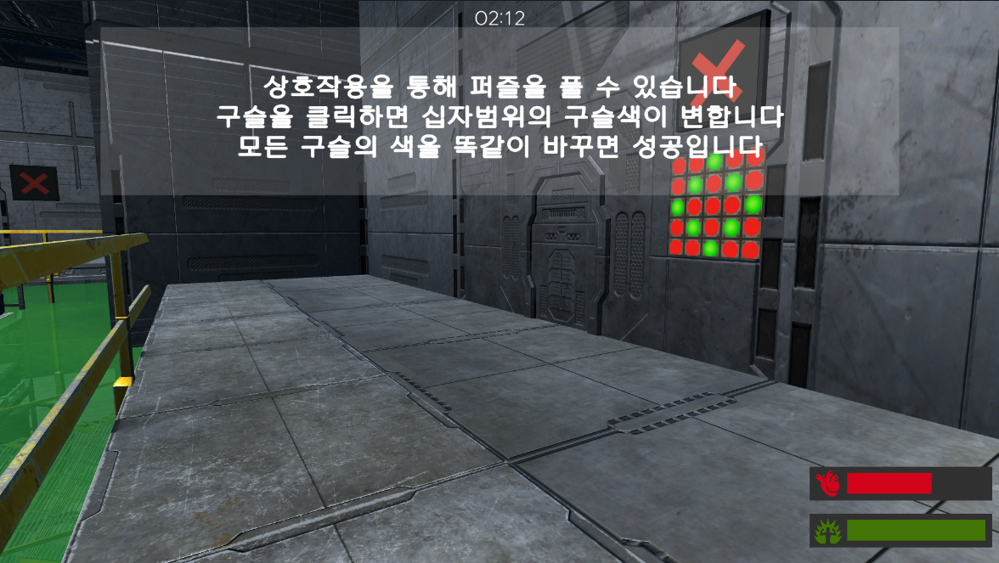

## 📦 사용한 외부 에셋

모든 외부 에셋은 `Assets/ExternalAssets` 폴더 내에서 관리되고 있습니다. 해당 폴더에 아래의 에셋을 임포트하여 실행해주세요.

https://assetstore.unity.com/packages/3d/environments/sci-fi/sci-fi-construction-kit-modular-159280

---
# 🧪 Escape from the Laboratory

> Unity 기반 3D 퍼즐 플랫포머 팀 프로젝트  
> 실험실을 탈출하기 위한 다양한 기믹과 장애물을 돌파하는 게임

---

## 📌 프로젝트 소개

**Escape from the Laboratory**는 플레이어가 실험체가 되어, 위험한 실험실을 탈출하는 3D 퍼즐 플랫포머 게임입니다.  
점프, 오브젝트 상호작용, 퍼즐 해결 등의 메커니즘을 통해 스테이지를 클리어해 나갑니다.

---

## 🎮 게임 장르

- 3D 퍼즐 플랫포머 (3D Puzzle Platformer)
- 3인칭 시점
- 레벨 기반 진행

---

## ✨ 주요 기능

- 다중 점프 및 중력 기반 플랫폼 점프
- 오브젝트 상호작용 (아이템 줍기/내려놓기)
- 간단한 퍼즐 메커니즘 (스위치, 문 개폐)
- 다양한 지형과 기믹(독가스)이 있는 실험실 환경

---

## 🖼️ 인게임 스크린샷

---

## 🔧 개발 환경

- **Unity Version**: Unity 2022 LTS  
- **언어**: C#  
- **버전관리**: GitHub + Git LFS  
- **작업툴**: Visual Studio, Unity Editor, Figma(디자인 협의용)

---

## 👨‍👩‍👧‍👦 팀 구성

| 이름       | 역할         |  작업내용 |
|------------|--------------|--------------|

| 이민호 | 팀장 | 퍼즐 씬 제작 |
| 손영준 | 팀원 | GameManager, 전체적인 작업물 조율, 세이브 기능, Github 관리 |
| 변세진 | 팀원 | 아이템 기믹, 튜토리얼, UI작업 보조 |
| 이정호 | 팀원 | 맵 제작 |
| 김희주 | 팀원 | 사운드 및 UI 관리 |
| 서정원 | 팀원 | 플레이어 이동 및 상호작용 구현 |

---

## 🎥 시연 영상

[👉 Escape from the Laboratory 플레이 영상 보기](https://github.com/YJSon91/88HealtyTeam.git)

---

## 📂 실행 방법

1. 이 저장소를 클론합니다.
2. Unity 2022 LTS로 열어 `Scenes/MainScene`을 실행합니다.
3. 에셋 스토어에서 외부 에셋을 임포트 합니다.
4. 게임 실행 (`Play`) 버튼을 누릅니다.

---

## 📄 라이선스

해당 프로젝트는 교육용 목적으로 제작되었으며, 상업적 이용은 금지됩니다.
